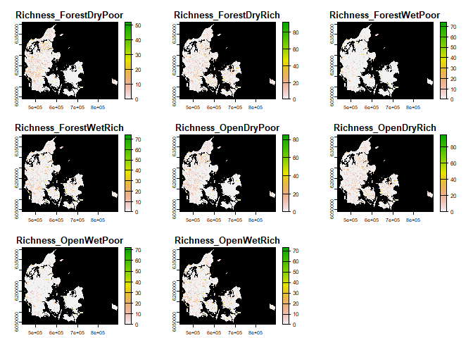
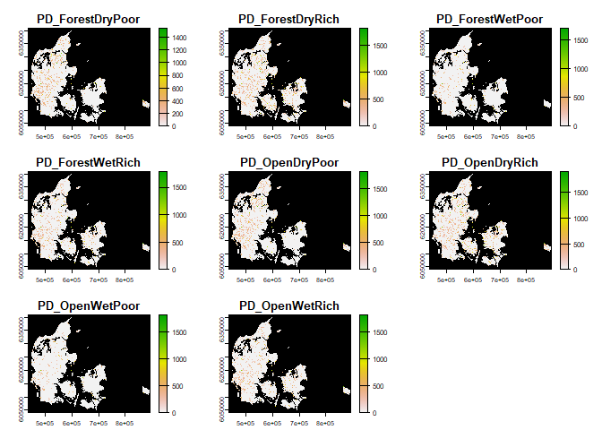
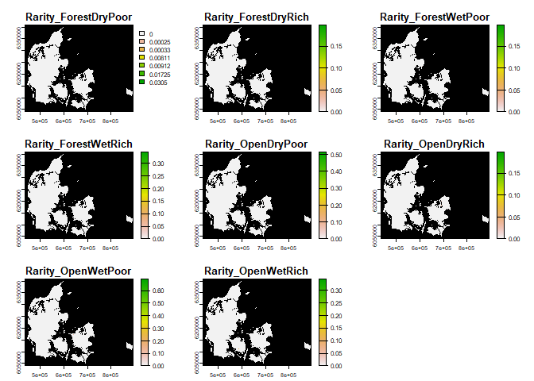

<!-- README.md is generated from README.Rmd. Please edit that file -->

# Targets_Species_Community

<!-- badges: start -->
<!-- badges: end -->

The goal of Targets_Species_Community is to recreate the community
generated but using the targets r package, here you can see the whole
workflow

# Results

With 2000 species the whole workflow finished some mistakes in 3.078
hours. Here are the results in tifs

## Richness

<!-- -->

## Phylogenetic diversity

<!-- -->

## Rarity

<!-- -->

test mermaid

Warning messages: 1: package ‘targets’ was built under R version 4.2.3
2: package ‘crew’ was built under R version 4.2.3 3: package
‘tarchetypes’ was built under R version 4.2.3

``` {mermaid}
graph LR
  style Graph fill:#FFFFFF00,stroke:#000000;
  subgraph Graph
    direction LR
    xd88abd50d7d969a8["Final_Presences"]:::errored --> x1ab2da0dbce80c54(["joint_final_presences"]):::outdated
    x6d51284275156668(["file"]):::uptodate --> xb7119b48552d1da3(["data"]):::uptodate
    x9c6d1c6ff27855c7(["LanduseSuitability"]):::uptodate --> xd8b9f31c0822a52d(["LanduseTable"]):::uptodate
    xc73d904d90e721c9["buffer_500"]:::errored --> xf4b68b9a0db047f1["Long_Buffer"]:::errored
    x1ab2da0dbce80c54(["joint_final_presences"]):::outdated --> x7eea86b153654cc3["rarity"]:::outdated
    x17bbde0022942793(["rarity_weight"]):::outdated --> x7eea86b153654cc3["rarity"]:::outdated
    x1ab2da0dbce80c54(["joint_final_presences"]):::outdated --> x17bbde0022942793(["rarity_weight"]):::outdated
    xfab3ac936a7a6fb3(["LandUseTiff"]):::uptodate --> xa7956357d7f8182e["Thresholds"]:::errored
    x54460dbf2d0d1aab["ModelAndPredict"]:::errored --> xa7956357d7f8182e["Thresholds"]:::errored
    x1234c39602c1f6ea["Presences"]:::uptodate --> xa7956357d7f8182e["Thresholds"]:::errored
    xb7119b48552d1da3(["data"]):::uptodate --> x76752fc0bd503faf(["Clean"]):::uptodate
    x54460dbf2d0d1aab["ModelAndPredict"]:::errored --> xbe15f87624992817(["LookUpTable"]):::outdated
    xa7956357d7f8182e["Thresholds"]:::errored --> xbe15f87624992817(["LookUpTable"]):::outdated
    xfab3ac936a7a6fb3(["LandUseTiff"]):::uptodate --> xb20884a1d0267e2d["output_Richness"]:::outdated
    xc60fb40d268bec96["PhyloDiversity"]:::outdated --> xb20884a1d0267e2d["output_Richness"]:::outdated
    x03de5d46cb8263bd(["Filter_Counts"]):::uptodate --> x01fcaa42022f4a51(["Phylo_Tree"]):::uptodate
    x03de5d46cb8263bd(["Filter_Counts"]):::uptodate --> x1234c39602c1f6ea["Presences"]:::uptodate
    xfab3ac936a7a6fb3(["LandUseTiff"]):::uptodate --> xc73d904d90e721c9["buffer_500"]:::errored
    x1234c39602c1f6ea["Presences"]:::uptodate --> xc73d904d90e721c9["buffer_500"]:::errored
    xd88abd50d7d969a8["Final_Presences"]:::errored --> x3295ae898e560fa5(["Richness"]):::outdated
    x1ab2da0dbce80c54(["joint_final_presences"]):::outdated --> xc60fb40d268bec96["PhyloDiversity"]:::outdated
    x01fcaa42022f4a51(["Phylo_Tree"]):::uptodate --> xc60fb40d268bec96["PhyloDiversity"]:::outdated
    x991d57889963b22e["Count_Presences"]:::uptodate --> x03de5d46cb8263bd(["Filter_Counts"]):::uptodate
    xfab3ac936a7a6fb3(["LandUseTiff"]):::uptodate --> x58fd9c294753b820["output_PD"]:::outdated
    xc60fb40d268bec96["PhyloDiversity"]:::outdated --> x58fd9c294753b820["output_PD"]:::outdated
    x76752fc0bd503faf(["Clean"]):::uptodate --> x7ced752a37ed4412(["Only_Plants"]):::uptodate
    xfab3ac936a7a6fb3(["LandUseTiff"]):::uptodate --> x54460dbf2d0d1aab["ModelAndPredict"]:::errored
    x1234c39602c1f6ea["Presences"]:::uptodate --> x54460dbf2d0d1aab["ModelAndPredict"]:::errored
    xfab3ac936a7a6fb3(["LandUseTiff"]):::uptodate --> x6e7e15abd6323cf0["output_Rarity"]:::outdated
    x7eea86b153654cc3["rarity"]:::outdated --> x6e7e15abd6323cf0["output_Rarity"]:::outdated
    x7ced752a37ed4412(["Only_Plants"]):::uptodate --> x991d57889963b22e["Count_Presences"]:::uptodate
    xd8b9f31c0822a52d(["LanduseTable"]):::uptodate --> x49cd1d3f69c871c0(["Long_LU_table"]):::uptodate
    xf4b68b9a0db047f1["Long_Buffer"]:::errored --> xd88abd50d7d969a8["Final_Presences"]:::errored
    x49cd1d3f69c871c0(["Long_LU_table"]):::uptodate --> xd88abd50d7d969a8["Final_Presences"]:::errored
    xbe15f87624992817(["LookUpTable"]):::outdated --> xd88abd50d7d969a8["Final_Presences"]:::errored
  end
  classDef errored stroke:#000000,color:#ffffff,fill:#C93312;
  classDef uptodate stroke:#000000,color:#ffffff,fill:#354823;
  classDef outdated stroke:#000000,color:#000000,fill:#78B7C5;
  classDef none stroke:#000000,color:#000000,fill:#94a4ac;
```
