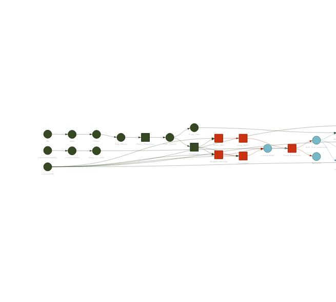
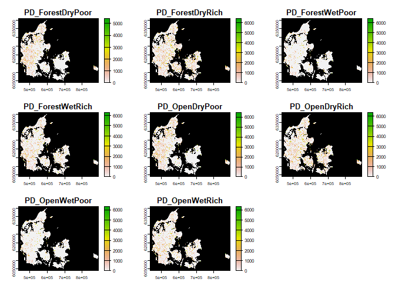
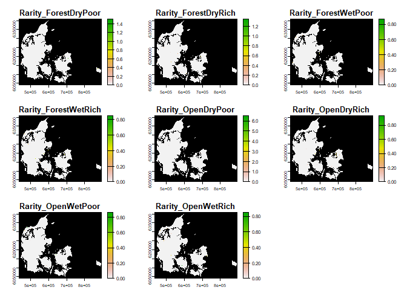

<!-- README.md is generated from README.Rmd. Please edit that file -->

# Targets_Species_Community

<!-- badges: start -->
<!-- badges: end -->

The goal of Targets_Species_Community is to recreate the community
generated but using the targets r package, here you can see the whole
workflow

    #> Warning messages:
    #> 1: package 'targets' was built under R version 4.2.3 
    #> 2: package 'crew' was built under R version 4.2.3 
    #> 3: package 'tarchetypes' was built under R version 4.2.3 

<!-- -->

# Results

With 200 species the whole workflow finished without mistakes in 1.905
hours. Here are the results in tifs

## Richness

``` r
tif_files_richness <- list.files("Results/Richness/", pattern = "\\.tif$", full.names = TRUE)
plot(terra::rast(tif_files_richness), colNA = "black")
```

<!-- -->

## Phylogenetic diversity

``` r
tif_files_PD <- list.files("Results/PD/", pattern = "\\.tif$", full.names = TRUE)
plot(terra::rast(tif_files_PD), colNA = "black")
```

<!-- -->

## Rarity

``` r
tif_files_rarity <- list.files("Results/Rarity/", pattern = "\\.tif$", full.names = TRUE)
plot(terra::rast(tif_files_rarity), colNA = "black")
```

<!-- -->
